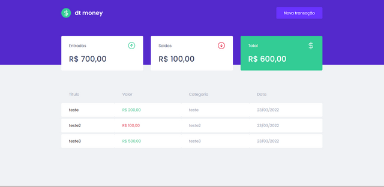

<h1 align="center">
🚀 dtmoney
</h1>

   
  
  

## 📫 Visualização do projeto

Carrinho de compras de uma loja de Tênis

## 💻 Projeto

O DtMoney é um projeto para controle de gastos

## 🤝 Como executar

- Clone o repositório
- Instale as dependências com `yarn`
- Inicie a fake api com `yarn server`
- Inicie o servidor com `yarn dev`

Agora você pode acessar [`localhost:3000`](http://localhost:3000) do seu navegador.

## 📫 Contribuindo para o Portfólio

Para contribuir com o Portfólio, siga estas etapas:

1. Bifurque este repositório.
2. Crie um branch: `git checkout -b <nome_branch>`.
3. Faça suas alterações e confirme-as: `git commit -m '<mensagem_commit>'`
4. Envie para o branch original: `git push origin <nome_do_projeto> / <local>`
5. Crie a solicitação de pull.

Como alternativa, consulte a documentação do GitHub em [como criar uma solicitação pull](https://help.github.com/en/github/collaborating-with-issues-and-pull-requests/creating-a-pull-request).

## 📜 Licença

Esse projeto está sob a licença MIT. Veja o arquivo [LICENSE](/LICENSE) para mais detalhes.

---

Feito com :purple_heart: by [Claudivan Santos](https://github.com/ClaudivanSantos) 